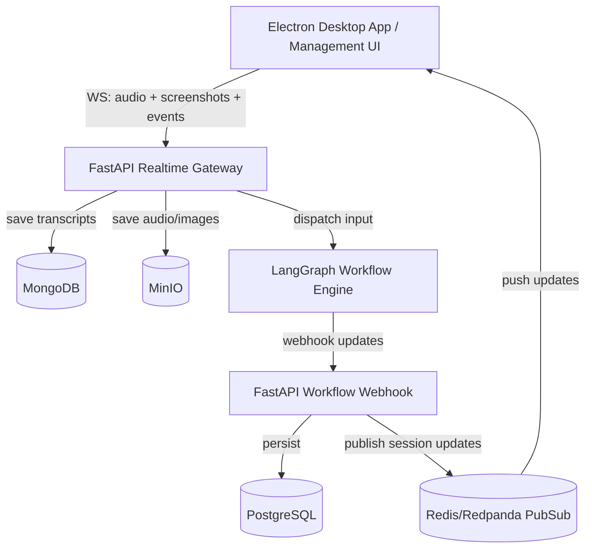
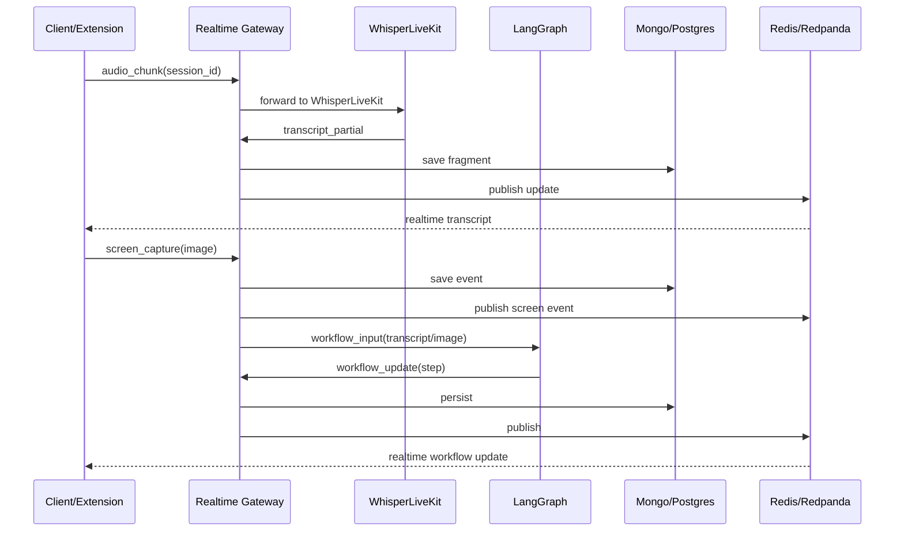

# Memoist — Realtime Multimodal Capture & AI Workflow Platform  
## Product Requirements Document (PRD)

Memoist is a real-time multimodal capture platform enabling live transcription, screen capture processing, and AI workflow execution using LangGraph. It supports multiple parallel sessions, custom workflows, auto-reconnection, and visual workflow authoring.

---

# 1. Product Overview
Memoist unifies audio, screen content, and workflow automation into a single seamless platform. It is used for:
- Meeting Notes (MoM)
- Personal Diary / Journaling
- Course & Lecture Assistant
- Research / Interview Summaries
- Custom AI workflows (visual + audio)

Memoist runs across:
- **Electron Desktop App** (audio & screencapture)
- **Management UI** (session dashboards + workflow builder)
- **Backend** (real-time gateway + workflow engine)

Each session is powered by WhisperLiveKit for transcription and LangGraph for reasoning.

---

# 2. Tech Stack Summary
## **Frontend**
- Next.js (App Router)
- Typescript
- TailwindCSS
- Zustand (state)
- WebSocket client
- ReactFlow (workflow builder)

## **Electron Desktop App**
- Electron (desktop client)
- Audio stream capture (system microphone)
- Screen capture (desktop/window sharing)
- Local secure storage for session recovery
- Custom backend URL configuration

## **Backend**
- FastAPI (real-time WebSocket + REST)
- JWT authentication
- Workflow webhooks

## **AI & Workflows**
- WhisperLiveKit (live speech-to-text)
- LangGraph (workflow orchestration)

## **Data Layer**
- MongoDB (transcription fragments + events)
- PostgreSQL (workflow states + structured data)
- MinIO (audio & image storage)
- Redis OR Redpanda (Pub/Sub for realtime updates)

---

# 3. Core Concepts
## **Session**
A unit of audio, screenshots, transcript, and workflow processing.
```
session_id
workflow_id
workflow_type
status: active | disconnected | completed
created_from: electron \| ui
```
Multiple sessions can run concurrently.

## **Workflow Selection**
When creating a session (extension or UI):
- User selects workflow type:
  - meeting_notes
  - diary
  - course_assistant
  - interview
  - custom_workflow (built in UI)

Workflow ID is attached to session metadata.

---

# 4. Reconnection Mechanism
Memoist supports two reconnection scenarios:

## **4.1 App reload or temporary disconnect**
- WebSocket reconnects automatically.
- Sends:
```json
{ "type": "resume_session", "session_id": "abc123" }
```
- Last 1–2 seconds audio optionally resent.
- Session returns to `active` state.

## **4.2 App closed or Electron process killed**
- Session becomes `disconnected`.
- Workflow continues using existing data.
- When Electron app reopens:
  - User sees incomplete sessions.
  - Selecting one sends:
```json
{ "type": "reconnect", "session_id": "abc123" }
```
Audio continues from new point in time.

---

# 5. Workflow Builder (Management UI)
Memoist includes a visual graph-based workflow editor powered by ReactFlow.

### Users can:
- Drag & drop nodes
- Connect logic flows
- Configure LLM steps
- Add tools (web search, custom API, RAG)
- Save workflow to database as versioned JSON
- Assign workflow to session
- Monitor node-by-node execution state

---

# 6. Node Types
## **6.1 Trigger Nodes** (entrypoints)
1. **Audio Stream Trigger** — fires on arriving audio chunks.
2. **Transcript Window Trigger** — fires on sentence/window boundaries.
3. **Event Trigger** — fires on events (start, end, disconnect, step_complete).
4. **Manual Trigger** — user-initiated via UI.
5. **Condition Trigger** — sentiment/topic/keyword detected.
6. **Time-Based Trigger** — interval or cron.
7. **Screencapture Trigger** — activates when extension sends screenshot.

## **6.2 Processing Nodes**
- LLM Reasoning Node (OpenAI / Anthropic / etc.)
- Vision Node (OCR, VLM interpretation)
- Summarization Node
- Embedding + RAG Node
- Topic Detection Node
- Sentiment Analysis Node

## **6.3 Tool Nodes**
- HTTP Request / API Call
- Database Write
- File Export (PDF/MD/JSON)

## **6.4 Output Nodes**
- Return structured results to session
- Emit MoM
- Emit diary entries
- Push workflow state updates

---

# 7. Screencapture Trigger Details
### Flow:
1. User initiates "Capture Screen" via Electron app.
2. Extension captures screenshot → sends:
```json
{
  "type": "screen_capture",
  "session_id": "abc123",
  "image": "<base64 or binary>"
}
```
3. Backend stores image → MinIO.
4. Publishes event: `screen_capture_received`.
5. Screencapture Trigger Node fires.
6. Downstream nodes process the image (OCR, VLM, summary extraction).

---

# 8. System Architecture


---

# 9. Data Flow


---

# 10. Session Lifecycle
```
created → active → (disconnected ↔ resumed) → completed
```
Workflows continue even if user disconnects.

---

# 11. Message Protocol (WebSocket)
## **Client → Backend**
```
init_session
resume_session
reconnect
send_audio_chunk
screen_capture
end_session
```

## **Backend → Client**
```
transcript_partial
transcript_final
workflow_update
session_status
error
```
---


